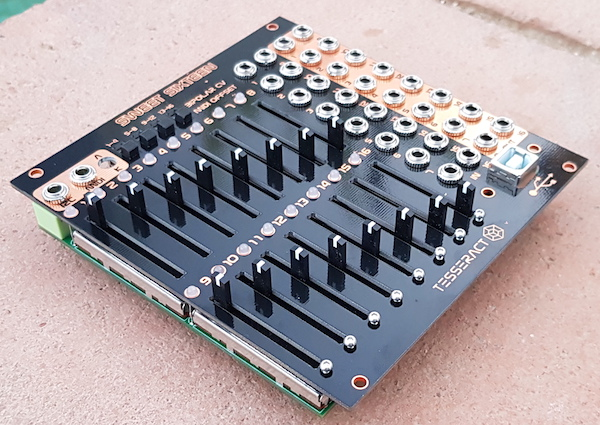

# Sweet-Sixteen
Based in the [16n faderbank][16n-faderbank/16n]. 
##The following changes were made to the original hardware:

-The UI and PCB layout has been made from scratch, so it's totally different, with 0603 passives instead of 0805.

-A power section has been added to work within the eurorack modular synth format, with diode protection and the option to power the Teensy with an internal 5V LDO or the eurorack 5V rail (selectable with a jumper on the back of the module). The voltage to feed the faders now comes form a dedicated voltage regulator, more stable and precise than many USB voltage sources.

-16 Inputs has been added. A "default voltage" is normalled to the input jacks, so when something is plugged in that normalization is broken, being the incomming CV attenuated by the fader. This adition makes the module to work also as 16 attenuators, Cv to Midi, Cv to i2C...

-The op-amps circuit has been modiffied, being TL074s for the CV outs and MCP6004s for the circuit that prepares the voltages to be read by the Teensy. In this version the MCP6004 are powered with 3,3V & GND (instead of the original 5V), the rail-to-rail characteristic of those op-amps provides voltage protection to the Teensy. That is specially handy for the CV inputs, as any voltage plugged in, will be limited to 3,3v by the MCP6004s. Another important modification in this part of the circuit is the addition of negative voltage references and also now is an summing inverting gain circuit (for that reason the FLIP option in the firmware is necessary for this version of the hardware, as in the minimum position of the fader the voltage readed by the Teensy will be 3,3V and in the max position it will be 0V). The TL074s are powered by +12V & -12V.

-Four slide switches has been added to swap the voltage reference (1 for every 4 faders, there was no room for 16 switches). The reason is to allow vnegative voltages to be coorectly converted to midi CC (or i2C). In the normal position 0V is traduced as minimum CC value, with the switch turned up the voltage reference is -2,5V (instead of -5V) that means that 0V is the center position of the MidiCC, positive voltages will increase the value while negative ones will decrease it.

-The output voltage of the faders (that "default voltage") has been increassed to 8v, the original 5v seems to be not enough to work in eurorack, like to wide open-close the cutoff of a filter etc. I decided to go 8v instead of 10v because of the Cv inputs, if the circuit that prepares the voltages comming from the faders to be readed by the Teensy is expecting 10v then it will be impossible to cover all the range of a MidiCC with an LFO which is ±4v (or 8v pp). For the contrary, if that circuit is expecting 8V it can not only cover the whole Midi CC range but also allows saturating the waveform if the voltage source has over 8V pp (like a 10V envelope or a ±5V LFO).

-16 bicolor leds has been added in parallel with the CV out, allowing visual feedback of what's going on each track, specially handy when using the CV inputs.

-USB type B connector pcb mounted has been also added. Those connectors are much stronger than mini or micro ones, the USB 5V pin is not connected, this way you can update the firmware of the Teensy without powering off the module.

The modifications in the firmware are minimal, added the possibility of choosing PitchBend instead of MidiCC (which gives much better resolution using the Midi protocol) and also to generate Midi Notes messages, but this last feature still in a experimental stage ...actually it creates a shit load of midi note events, but it could be better implemented in the future.

[firmware](_16n_faderbank_firmware_Sweet/)

[hardware](hardware/)

There are 16 channels, which can be used as:

 -Midi controller

 -Manual CV generator (0 to 8v range)

 -Attenuator

 -CV to Midi CC

 -i2C controller

 -CV to i2C data

Features:

 -16 inputs
 
 -16 outputs
 
 -16 faders
 
 -16 bi-color leds to show what's going on in every channel
 
 -Midi trs out
 
 -Jumpers on the back to swap between 'Arturia/Novation'  and 'Korg/Makenoise' Midi trs standards
 
 -USB Midi out (connector type B, usb midi class compliant device)
 
 -4 switches to enable bi-polar CV to Midi/i2C conversion (one for every 4 channels)
 
 -i2C via mini jack on front panel and pin header on the back of the module.

## Credits
This is a derivative work of the [16n faderbank][16n-faderbank/16n]

Based on original work by [Brian Crabtree][tehn] and Sean Hellfritsch.  
Minijack MIDI, I2C circuitry and CV outputs by [Tom Armitage][infovore].  
Firmware by [Brian Crabtree][tehn], [Tom Armitage][infovore], and [Brendon Cassidy][bpcmusic].

## Licensing

Panels and electronic schematics/layouts/gerber files are licensed under
[Creative Commons Attribution Share-Alike 4.0][ccbysa].

Firmware is licensed under the [MIT License][mitlicense].

[linespost]: https://llllllll.co/t/sixteen-n-faderbank/3643
[tehn]: https://github.com/tehn
[bpcmusic]: https://github.com/bpcmusic
[infovore]: https://github.com/infovore
[octobom]: https://octopart.com/bom-tool/unJxkzvR
[ccbysa]: https://creativecommons.org/licenses/by-sa/4.0/
[mitlicense]: https://opensource.org/licenses/MIT
[16n-faderbank/16n]: https://github.com/16n-faderbank/16n
